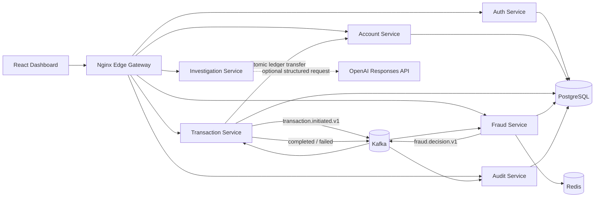

# Architecture

## Context

FinGuard AI models a transfer workflow where transaction acceptance and money movement are separate steps. The API returns `202 Accepted`; fraud evaluation occurs asynchronously; account balances change only after approval.

## Consistency model

- Account mutations are strongly consistent inside `account-service` through row locks and database transactions.
- Cross-service processing is eventually consistent.
- Transfer submission and event creation use a transactional outbox.
- Kafka delivery is at least once; consumers and balance operations are idempotent.
- The account service owns both balance mutations and commits the debit and credit legs atomically in one database transaction.

## Topics

| Topic | Producer | Consumers | Purpose |
|---|---|---|---|
| `transaction.initiated.v1` | Transaction | Fraud, Audit | Request risk evaluation |
| `fraud.decision.v1` | Fraud | Transaction, Audit | Approve, reject, or flag |
| `transaction.completed.v1` | Transaction | Audit | Record successful settlement |
| `transaction.failed.v1` | Transaction | Audit | Record processing failure |

## Boundaries

Each service owns its database schema. The single PostgreSQL container in Docker Compose is a cost-saving local-development choice; it creates separate logical databases and does not permit cross-service table access.

## AI investigation boundary

The investigation service is deliberately outside the transfer execution path. It accepts only structured synthetic case facts from an authenticated analyst, can optionally call the OpenAI Responses API, and falls back to deterministic summarization when no key is configured or the provider fails. Its output is advisory and cannot change transaction state.
